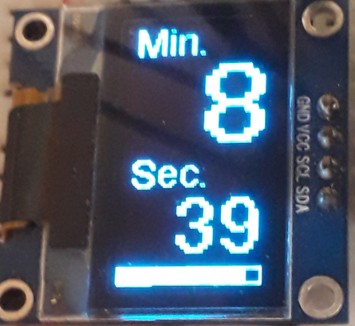
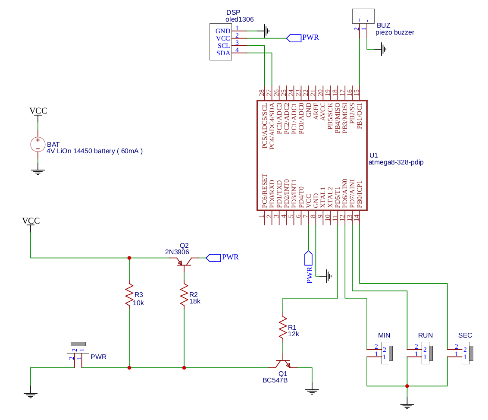
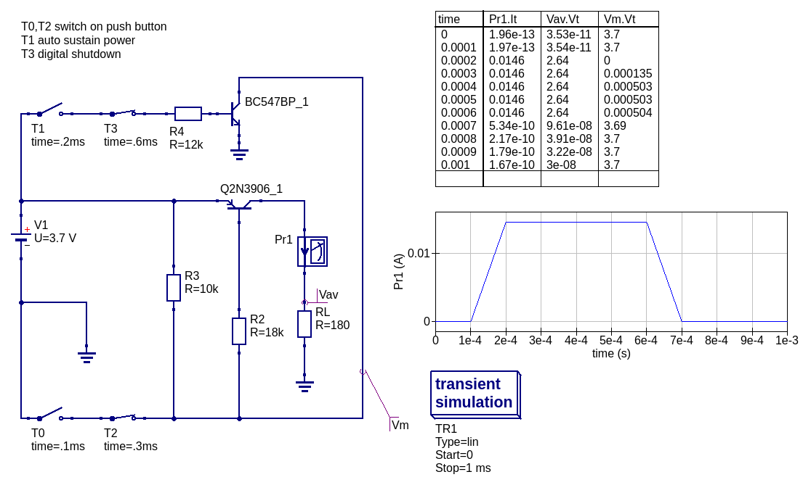

# iot-cook-timer

minutes, seconds timeout cook timer

## features

- set minutes, seconds add with push buttons
- countdown with progressbar
- key tones
- time expire audibile 10 sec sound
- standby power <0.00uA
- active power 18mA
- battery LiOn 3.7V power source
- autoshutdown after 10 sec

## dev env

- [vscode arduino](https://github.com/devel0/knowledge/blob/master/doc/vscode-arduino.md)
- arduino libraries ( available through Library Manager )
  - [OneWire](https://www.pjrc.com/teensy/td_libs_OneWire.html)
  - [Adafruit SSD1306](https://github.com/adafruit/Adafruit_SSD1306)
  - [Adafruit GFX](https://github.com/adafruit/Adafruit-GFX-Library)
  - [arduino-utils](https://github.com/devel0/iot-arduino-utils)

## hardware

- atmega328p
- oled ssd1306 128x64 two wire interface
- piezo buzzer

## connections

- [schematics and pcb](https://easyeda.com/editor#id=|7909cea401894073bcae4e8e6450cbe7|0390ee86049a4889954c34540dc8de61) also available ready to print [pcb](doc/pcb.pdf) [labels](doc/pcb-labels.pdf)
- power on
  - push button ( replace T0/T2 in schematics below ) ; this required for power on cycle
- atmega328p
  - `GND`
  - `VCC` from load power management circuit (see below)
  - `SCL SDA` to oled
  - digital pin 9 to piezo (+)
  - `TX` to serial `RX` (optional)
  - digital pin 5 to NPN transistor base ( replace T1/T3 in schematics below ) ; this required to maintain PNP transistor active until auto shutdown
  - digital pin 6 ( MINUTES ADD ) to push button pulled down with R10K to GND
  - digital pin 7 ( SECONDS ADD ) to push button pulled down with R10K to GND
  - digital pin 8 ( START COUNTDOWN ) to push button pulled down with R10K to GND
- serial (optional)
  - `GND`
- piezo
  - `GND`
- oled
  - `GND`
  - `VCC` from load power management circuit (see below)  

## 3d print

- 3d print pieces [front](doc/front.stl) [lateral](doc/tri.stl) with freecad [src](doc/box.fcstd)

## power management circuit

- [qucs simulation](doc/prj.sch)
- T0,T2 describe power on switch in a transient way ( T0 switches to close after 0.1ms enabling power while T2 switches to open after 0.3ms simulating push button release )
- T1,T3 describe digital pin 5 that maintains system on until pin goes low disabling main transistor Q2N3906
- RL represents atmega+oled consumption
- R3 is a pullup resistor to avoid Q2N main transistor draw a little current 0.3uA when system powered off
- graph shown power on switch (T0T2) at 1e-4s ; system autosustain (T1T3) at 2e-4 where Vm near 0mV ; power on switch release at 3e-4 with no effect due to BC547 activated transistor ; shutdown at 6e-4 by toggling T3 ( digital pin 5 low )
